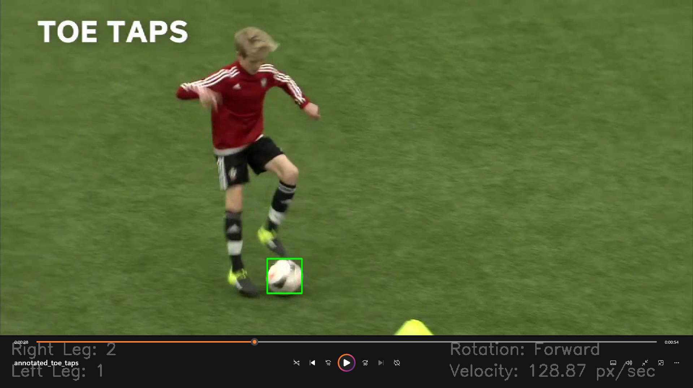

## 📌 Objective
This project analyzes a player’s interactions with a ball in a video, focusing on biomechanical movements. The system dynamically overlays the following data on the video:

- **Touch Count: Right Leg** – Number of times the player touches the ball with the right leg.  
- **Touch Count: Left Leg** – Number of times the player touches the ball with the left leg.  
- **Ball Rotation** – Direction of ball rotation (forward/backward).  
- **Player Movement Velocity** – Player’s velocity (px/sec) at each touch point.  

The deliverable is an annotated video with dynamic overlays, along with a detailed explanation of the methods used.

---

## 📂 Project Structure

```

├── annotated\_toe\_taps\_final.mp4   # Output annotated video
├── Toe Taps.mp4                   # Input video (provided)
├── video\_analysis.py              # Main script
├── requirements.txt               # Dependencies
└── README.md                      # Project documentation

````

---

## ⚙️ Installation

```bash
# Clone repository
git clone <your_repo_link>
cd <your_repo_name>

# Create virtual environment (recommended)
python3 -m venv venv
source venv/bin/activate   # Linux/Mac
venv\Scripts\activate      # Windows

# Install dependencies
pip install -r requirements.txt
````

**requirements.txt**

```
opencv-python
mediapipe
numpy
```

---

## ▶️ Usage

1. Place the input video (`Toe Taps.mp4`) in the project directory.
2. Run the analysis script:

```bash
python video_analysis.py
```

3. The processed video will be saved as:

   ```
   annotated_toe_taps_final.mp4
   ```

---

## 🧠 Methodology

### 1. Touch Count (Right & Left Leg)

* Pose landmarks extracted using **MediaPipe Pose**.
* Detected keypoints: `LEFT_FOOT_INDEX`, `RIGHT_FOOT_INDEX`.
* Distance between foot and ball center calculated.
* If within threshold → counted as a **touch**.
* A cooldown mechanism prevents multiple counts for a single contact.

### 2. Ball Detection & Rotation

* Ball detected using **HSV color thresholding** + **circularity check**.
* Rotation estimated using **optical flow (Farneback method)** on ball ROI between consecutive frames.
* Average flow direction determines:

  * Positive → **Forward rotation**
  * Negative → **Backward rotation**

### 3. Player Velocity

* Hip landmarks (`LEFT_HIP`, `RIGHT_HIP`) used to compute player center.
* Displacement over a fixed frame window (`VELOCITY_FRAME_DELTA`) divided by elapsed time gives **velocity in px/sec**.
* Velocity displayed dynamically at each touch event.

---

## 📊 Results

* **Accurate leg-specific touch counts** with noise reduction via distance threshold & cooldown.
* **Reliable ball rotation detection** using optical flow.
* **Meaningful velocity estimation** aligned with biomechanical movements.
* Final annotated video dynamically displays:

  * Right Leg Taps
  * Left Leg Taps
  * Ball Rotation
  * Player Velocity

---

## 📝 Evaluation Criteria Mapping

* ✔️ **Accuracy** in touch counting & leg identification
* ✔️ **Precision** in ball rotation detection
* ✔️ **Feasibility** of velocity estimation
* ✔️ **Clarity** in documentation & methodology
* ✔️ **Dynamic annotated video** as final output

---

## 📌 Deliverables

1. **Annotated video** (`annotated_toe_taps_final.mp4`) with all overlays.
2. **Detailed report** (this README) describing methods and techniques used.
3. **Codebase** with clean, modular implementation.

---

## 🚀 Future Improvements

* Training a lightweight **ball detection model** for robust detection in varied conditions.
* 3D motion analysis using multiple camera angles.
* Integration of multimodal data (e.g., audio cues, sensor data) for advanced biomechanical insights.

---

👨‍💻 Developed as part of the **Computer Vision Engineer Assignment**.

```

---

Do you also want me to prepare a **short PDF report version** (summarized from this README) for submission, since the assignment explicitly asks for a detailed report?
```
